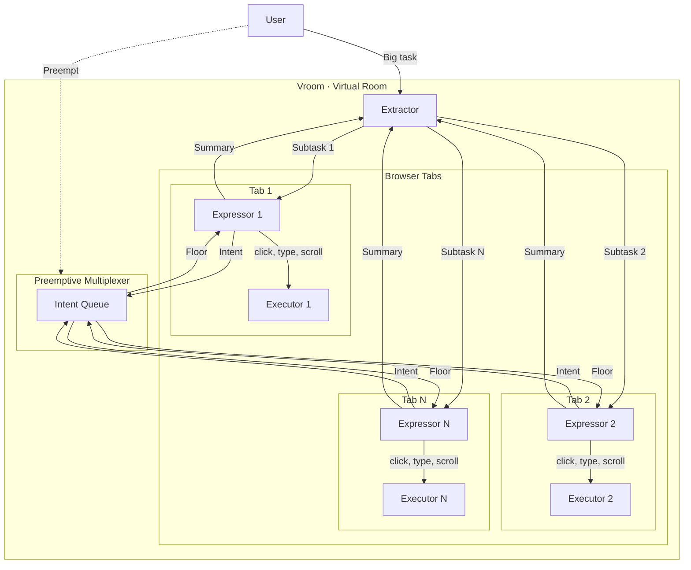
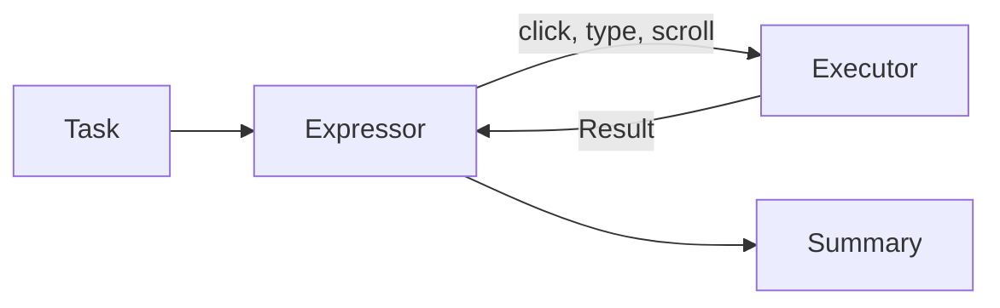
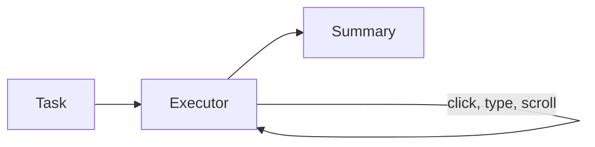
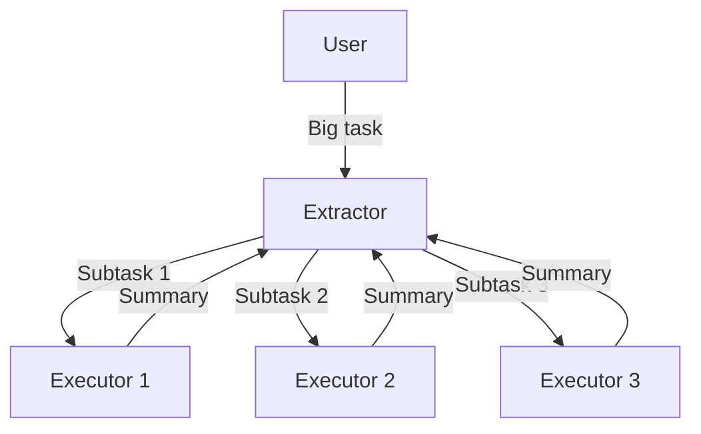
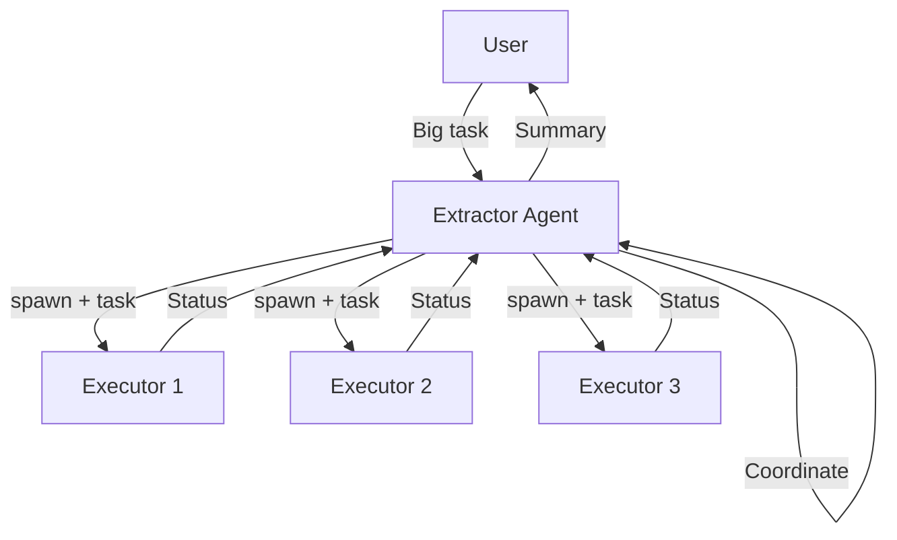

# The Amnesiac That Needs Handholding

I've been using browser agents more lately, Claude's in particular. Most of my work can't go through MCP yet, so the browser is the only real interface. Here's a recollection of what I went through yesterday.

## Case Study: Adding Skills to Linkedin

Linkedin has probably one of the worst UIs for adding skills (possibly worse than myworkday). So I wanted to use this new piece of tech to automate it for me (seems something mundane that it'll excel at).

I gave it my projects and asked it to extract the skills and add them into Linkedin. It started off great, reading my Github READMEs, extracting the skills, and then adding those into Linkedin. But after a few minutes, the performance degraded, so I had to remind it that it was supposed to add unique skills (not just Python and API Development for the 6th time). I was watching over it, just making sure it wasn't gonna go on a Linkedin connection spree.

Here's the issue though: the entire process was slow and tiring.

## The Problem

I was watching an agent slowly screenshot the Github README, extracting the skills, then adding the skills one by one, in the midst of that forgetting that it was supposed to be deeper than just "API Development". I had to preempt it several times just to get the job half done, and I decided it was time to do it myself.

The technology has vast potential. But thinking of it as an agent manipulating the screen using tools... might be the wrong way to go about it.

# Finding the Deeper Structure in the Problem

## The Prompt

Starting with the prompt: I gave the agent a humongous task of adding 10 skills for 5 projects after referring to my Github. Is that actually one task though? Adding skills for a single project is a task. Adding a single skill is a task.

This raises the question: **do we really need a single agent to be doing all that? Can we make it faster? (the question makes the answer obvious).**

## The Execution

Execution was reasonably good, except for the fact that instructions weren't being followed. Why is that? Three possible reasons:

1. **The instruction** wasn't clear enough or what you thought "unique" meant wasn't the same as what the model thought it meant.
2. The model simply had **different priorities** (I mean when you're dealing with Linkedin's UI, you would want to focus on clicking all those buttons first).
3. The **context is diluted** because of the sheer amount of information.

For problem (1), **does correcting the model really have to be as difficult as stopping the entire flow to course correct? Can't we nudge it in the middle of its work?**

But more importantly, for problem (2) and (3), does the model really have to take on the burden of interacting with the screen and dealing with your intended task at the same time?

To expand on this: imagine your coding agent not having any tools at its disposal except for bash commands. It will need to make a curl command to request for docs, do some manoeuvre to replace text and so on. This is arguably going a level deeper than that of intent. It is going to a level of implementation. Now, the agent has 2 tasks, getting the implementation right as well as making sure the user intent is met. That's a tough ask. It also overloads your context window with stuff that you don't even need.

So, **do we need the agent to be clicking a messy interface and deal with prompt shenanigans at the same time? Could we possibly abstract these two away?**

# The Shape of the Solution

What I'd imagine the solution would look like to the 3 questions is a new model of interaction within the system. A new architecture where there is not one monolithic abstraction, but many smaller ones that allow the model to carry them out efficiently.

## The Architecture

Without further deliberation, I will present my proposed architecture (we will change this throughout):

The key things to take away from the diagram above are these keywords: **Extractor**, **Expressor**, **Executor**, and **Preemptive Multiplexer** as they answer our 3 questions directly.

**The extractor** takes a big task from the user, extracts the smaller independent tasks and delegates it to **expressors**. This avoids a single agent needing to do everything end-to-end, addressing our **first question**.

An **expressor** is assigned its own tab on the browser, where it can execute its given task. It doesn't directly click on any UI elements, instead it issues intentions to click to the **executor** which executes that intention. This design addresses our **third question**, abstracting away the high level intent from low level working. The expressor is pure in a way, it takes in a task and returns a meaningful summary of what it has done.

The problem with this design though is that the expressors are executing independently in parallel. Earlier, I asked my agent to add unique skills. But expressors executing in parallel have no idea what other expressors have added, so it really can't be universally unique. Unless **they can communicate with each other**.

`n * n` communication can get messy, and humans have almost no way of comprehending all that's going on. So, I took the liberty of being slightly more opinionated here by having the concept of a floor. One agent speaks at a time. If the expressor wants to speak, it **sends an intention to speak**. The intent to speak is then queued, and a **multiplexer** dequeues one by one to allow agents to speak.

A nice side effect of this design is that we can allow the human to participate as a **vetoing agent** (hence, the term preemptive). A human can step in mid-conversation, state a message which is broadcasted and the agents will steer their work. That's the **preemptive multiplexer** and it directly addressses the **second question**.

## Mode of Interaction

So the proposed usage will look like this: **you're running 5 agents all at once, running on 5 tabs**. Do you click through all those tabs to see what the agent is doing? The agent might actually do something unintended when you're not looking. What came to mind to solve this is a single screen showing all the other tabs at once, and you get an eagle's eye view on what's going on.

It's like a Zoom meeting of AI Agents.

And while communication can be text-based, where's the fun in that? We could make the agent's **talk to each other through audio**, the human could also preempt the activity and steer the agents through voice.

Just like an actual Zoom meeting.

So, I decided to name this system Virtual Room (or Vroom in short).

# Implementation

Grandiose ideas out of the way, let's actually see if we can make agents work like this.

## Phase 1: The Expressor

The expressor is **interactive** and the executor is more **task-bound**. So, I picked suitable technologies for these classes. For the expressor, I decided to use the Gemini Live API, which is innately interactive and supports audio. For the executor, I used the GenAI SDK, though I might change it to ADK in the future.

The expressor was given a single tool: **a tool to express intent**. The executor was given 4 tools: **click**, **scroll**, **type**, and **done**.

It was all packaged into a Chrome extension that interfaced with a Python server which served as the brain of the entire operation. And it worked... to a limited degree.

## Hurdle 1A

Throughout this entire session, the executor agent was working perfectly, thanks to Gemini's ability to **detect bounding boxes**, clicking was incredibly easy.

What was unexpected though, was the fact that the Live API was **hallucinating minor details** across different sessions. Honestly, my setup could have just been wrong but I choose to trust my intuition here: something didn't add up, it was making sense on some facts and making up some facts, but in my tests (that I ran separately), **if it knew the facts that made sense, then it must know the truths behind the stuff it made up.**

To visualise what I just said: I have a window on the left side of the screen.

> I asked it, "Where is the window?".
>
> "Left side," it said.
>
> I moved the window to the right side, I asked it, "What happened to the window?".
>
> "You moved it to the right," it replied.
>
> I asked it again, "Where is the window?".
>
> "Left side," it said, when the window was clearly on the right side.

The point is: the current system is **fragile**. It will be great if we can leverage both the **interactivity** of the Gemini Live API and the **reliability** of the GenAI SDK.

And honestly, the current architecture **might be wrong** (LOL). Lesson learnt: don't use Live API for UI manipulation. Use GenAI SDK instead.

## Iteration 1A

Since the GenAI SDK is so reliable at doing UI work, could we perhaps make it do everything. Literally, an executor with its own intentions, not receiving intentions from an expressor. Back to the conventional architecture for browser use agents.

And it worked! This could potentially still benefit from separating intent from UI manipulation, but what strikes me here is that the **gap between intent and UI manipulation is seriously so small** when we're using Gemini. Mainly because it's post-trained to detect where to click **just from what it's seeing instead of needing to inspect the DOM**.

I will come back to this idea of separating intent in the future if needed. But for now, seems like Gemini is already doing much better than expected.

# Phase 2: The Extractor

The goal would be to try to get an extractor to spawn 3 executors to execute a task. It will be an interesting sight to behold.

Ok, this was really surprisingly good for a first try. I was taken aback myself. But still...

## Hurdle 2A

Right now, it was a fire-and-forget mechanism. The extractor extracts the task, and forgets about it totally. We want the extractor to play the vital role of a coordinator throughout the execution. So, the extractor itself must be an agent with access to tools to create executors.

## Iteration 2A

I took a little inspiration from operating systems and processes and how they **wait for each other**. Every time the extractor decides to create an executor it **receives an id**, like a PID. It can then choose to **wait** for that specific id, which will block the agent until that executor is done, or it could **wait for all or any** of the executors to be done. I think it's a really nice and established design.

And it worked nicely! Notice how only the Toyota tab is open because the other two are already done.

# Phase 3: The Dashboard

Now that we have many agents running at the same time, it will be wise for us to have a single dashboard to see everything that's going on. The goal will be to track exactly which tabs are open and show them on the dashboard.

This is the outcome and I'm honestly really happy with it. At this point, it genuinely feels like an improvement to my productivity because I am no longer waiting for one agent, but watching many agents execute at a much faster rate on multiple windows.
