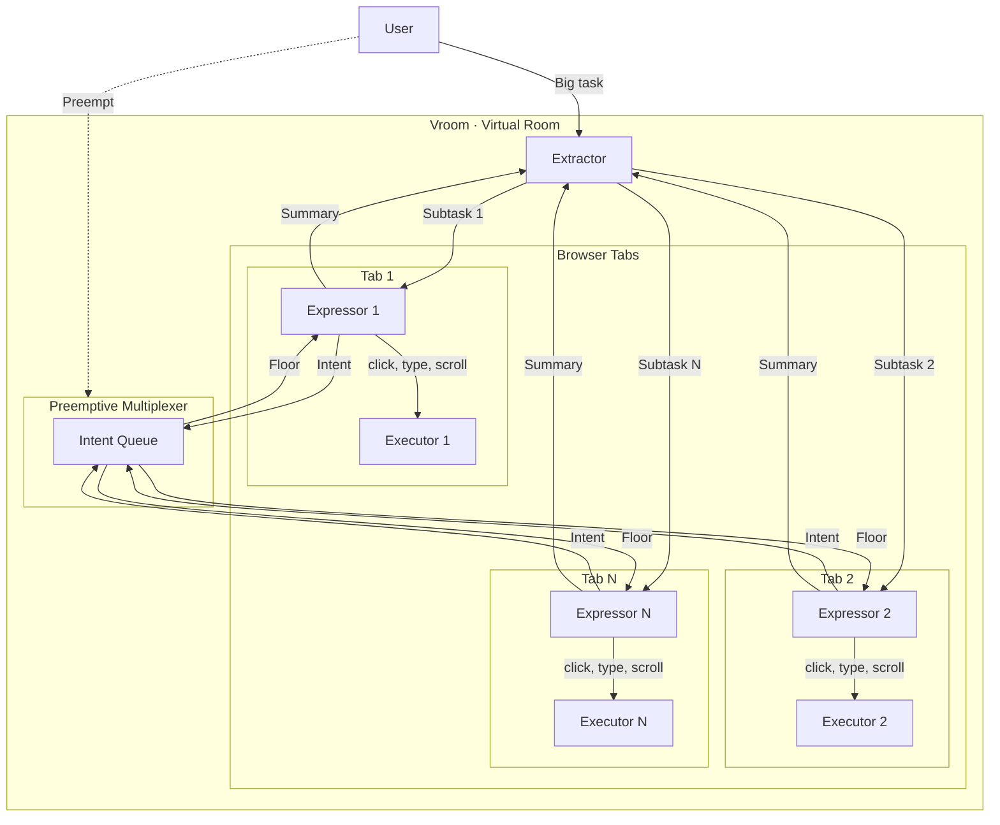
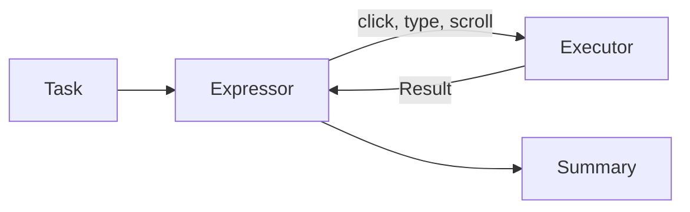
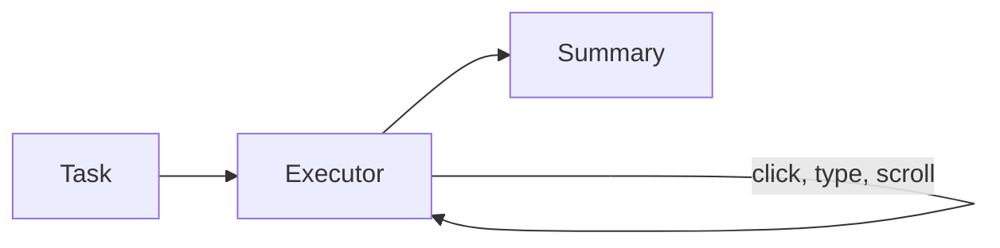
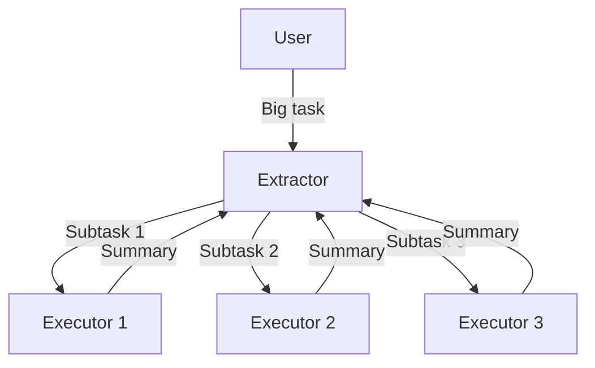
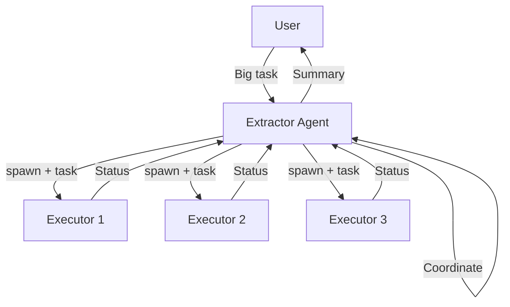
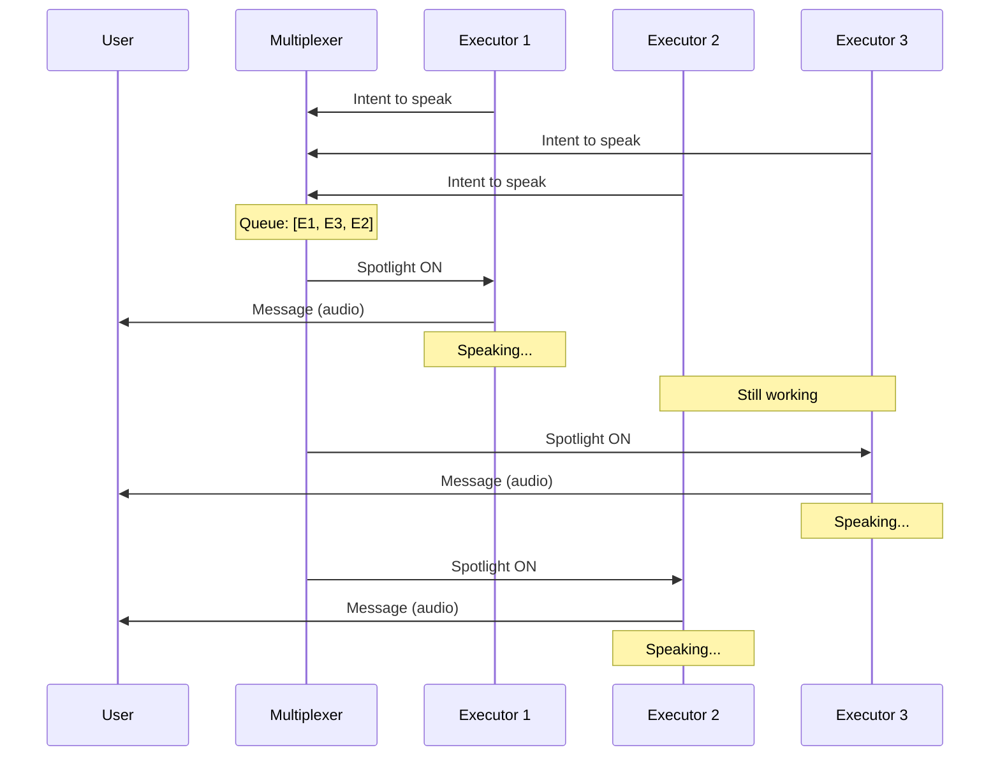

# The Amnesiac That Needs Handholding

I've been using browser agents more lately, Claude's in particular. Most of my work can't go through MCP yet, so the browser is the only real interface. Here's a recollection of what I went through yesterday.

## Case Study: Adding Skills to Linkedin

Linkedin has probably one of the worst UIs for adding skills (possibly worse than myworkday). So I wanted to use this new piece of tech to automate it for me (seems something mundane that it'll excel at).

I gave it my projects and asked it to extract the skills and add them into Linkedin. It started off great, reading my Github READMEs, extracting the skills, and then adding those into Linkedin. But after a few minutes, the performance degraded, so I had to remind it that it was supposed to add unique skills (not just Python and API Development for the 6th time). I was watching over it, just making sure it wasn't gonna go on a Linkedin connection spree.

Here's the issue though: the entire process was slow and tiring.

## The Problem

I was watching an agent slowly screenshot the Github README, extracting the skills, then adding the skills one by one, in the midst of that forgetting that it was supposed to be deeper than just "API Development". I had to preempt it several times just to get the job half done, and I decided it was time to do it myself.

The technology has vast potential. But thinking of it as an agent manipulating the screen using tools... might be the wrong way to go about it.

# Finding the Deeper Structure in the Problem

## The Prompt

Starting with the prompt: I gave the agent a humongous task of adding 10 skills for 5 projects after referring to my Github. Is that actually one task though? Adding skills for a single project is a task. Adding a single skill is a task.

This raises the question: **do we really need a single agent to be doing all that? Can we make it faster? (the question makes the answer obvious).**

## The Execution

Execution was reasonably good, except for the fact that instructions weren't being followed. Why is that? Three possible reasons:

1. **The instruction** wasn't clear enough or what you thought "unique" meant wasn't the same as what the model thought it meant.
2. The model simply had **different priorities** (I mean when you're dealing with Linkedin's UI, you would want to focus on clicking all those buttons first).
3. The **context is diluted** because of the sheer amount of information.

For problem (1), **does correcting the model really have to be as difficult as stopping the entire flow to course correct? Can't we nudge it in the middle of its work?**

But more importantly, for problem (2) and (3), does the model really have to take on the burden of interacting with the screen and dealing with your intended task at the same time?

To expand on this: imagine your coding agent not having any tools at its disposal except for bash commands. It will need to make a curl command to request for docs, do some manoeuvre to replace text and so on. This is arguably going a level deeper than that of intent. It is going to a level of implementation. Now, the agent has 2 tasks, getting the implementation right as well as making sure the user intent is met. That's a tough ask. It also overloads your context window with stuff that you don't even need.

So, **do we need the agent to be clicking a messy interface and deal with prompt shenanigans at the same time? Could we possibly abstract these two away?**

# The Shape of the Solution

What I'd imagine the solution would look like to the 3 questions is a new model of interaction within the system. A new architecture where there is not one monolithic abstraction, but many smaller ones that allow the model to carry them out efficiently.

## The Architecture

Without further deliberation, I will present my proposed architecture (we will change this throughout):

The key things to take away from the diagram above are these keywords: **Extractor**, **Expressor**, **Executor**, and **Preemptive Multiplexer** as they answer our 3 questions directly.

**The extractor** takes a big task from the user, extracts the smaller independent tasks and delegates it to **expressors**. This avoids a single agent needing to do everything end-to-end, addressing our **first question**.

An **expressor** is assigned its own tab on the browser, where it can execute its given task. It doesn't directly click on any UI elements, instead it issues intentions to click to the **executor** which executes that intention. This design addresses our **third question**, abstracting away the high level intent from low level working. The expressor is pure in a way, it takes in a task and returns a meaningful summary of what it has done.

The problem with this design though is that the expressors are executing independently in parallel. Earlier, I asked my agent to add unique skills. But expressors executing in parallel have no idea what other expressors have added, so it really can't be universally unique. Unless **they can communicate with each other**.

`n * n` communication can get messy, and humans have almost no way of comprehending all that's going on. So, I took the liberty of being slightly more opinionated here by having the concept of a floor. One agent speaks at a time. If the expressor wants to speak, it **sends an intention to speak**. The intent to speak is then queued, and a **multiplexer** dequeues one by one to allow agents to speak.

A nice side effect of this design is that we can allow the human to participate as a **vetoing agent** (hence, the term preemptive). A human can step in mid-conversation, state a message which is broadcasted and the agents will steer their work. That's the **preemptive multiplexer** and it directly addressses the **second question**.

## Mode of Interaction

So the proposed usage will look like this: **you're running 5 agents all at once, running on 5 tabs**. Do you click through all those tabs to see what the agent is doing? The agent might actually do something unintended when you're not looking. What came to mind to solve this is a single screen showing all the other tabs at once, and you get an eagle's eye view on what's going on.

It's like a Zoom meeting of AI Agents.

And while communication can be text-based, where's the fun in that? We could make the agent's **talk to each other through audio**, the human could also preempt the activity and steer the agents through voice.

Just like an actual Zoom meeting.

So, I decided to name this system Virtual Room (or Vroom in short).

# Implementation

Grandiose ideas out of the way, let's actually see if we can make agents work like this.

## Phase 1: The Expressor

The expressor is **interactive** and the executor is more **task-bound**. So, I picked suitable technologies for these classes. For the expressor, I decided to use the Gemini Live API, which is innately interactive and supports audio. For the executor, I used the GenAI SDK, though I might change it to ADK in the future.

The expressor was given a single tool: **a tool to express intent**. The executor was given 4 tools: **click**, **scroll**, **type**, and **done**.

It was all packaged into a Chrome extension that interfaced with a Python server which served as the brain of the entire operation. And it worked... to a limited degree.

## Hurdle 1A

Throughout this entire session, the executor agent was working perfectly, thanks to Gemini's ability to **detect bounding boxes**, clicking was incredibly easy.

What was unexpected though, was the fact that the Live API was **hallucinating minor details** across different sessions. Honestly, my setup could have just been wrong but I choose to trust my intuition here: something didn't add up, it was making sense on some facts and making up some facts, but in my tests (that I ran separately), **if it knew the facts that made sense, then it must know the truths behind the stuff it made up.**

To visualise what I just said: I have a window on the left side of the screen.

> I asked it, "Where is the window?".
>
> "Left side," it said.
>
> I moved the window to the right side, I asked it, "What happened to the window?".
>
> "You moved it to the right," it replied.
>
> I asked it again, "Where is the window?".
>
> "Left side," it said, when the window was clearly on the right side.

The point is: the current system is **fragile**. It will be great if we can leverage both the **interactivity** of the Gemini Live API and the **reliability** of the GenAI SDK.

And honestly, the current architecture **might be wrong** (LOL). Lesson learnt: don't use Live API for UI manipulation. Use GenAI SDK instead.

## Iteration 1A

Since the GenAI SDK is so reliable at doing UI work, could we perhaps make it do everything. Literally, an executor with its own intentions, not receiving intentions from an expressor. Back to the conventional architecture for browser use agents.

And it worked! This could potentially still benefit from separating intent from UI manipulation, but what strikes me here is that the **gap between intent and UI manipulation is seriously so small** when we're using Gemini. Mainly because it's post-trained to detect where to click **just from what it's seeing instead of needing to inspect the DOM**.

I will come back to this idea of separating intent in the future if needed. But for now, seems like Gemini is already doing much better than expected.

# Phase 2: The Extractor

The goal would be to try to get an extractor to spawn 3 executors to execute a task. It will be an interesting sight to behold.

Ok, this was really surprisingly good for a first try. I was taken aback myself. But still...

## Hurdle 2A

Right now, it was a fire-and-forget mechanism. The extractor extracts the task, and forgets about it totally. We want the extractor to play the vital role of a coordinator throughout the execution. So, the extractor itself must be an agent with access to tools to create executors.

## Iteration 2A

I took a little inspiration from operating systems and processes and how they **wait for each other**. Every time the extractor decides to create an executor it **receives an id**, like a PID. It can then choose to **wait** for that specific id, which will block the agent until that executor is done, or it could **wait for all or any** of the executors to be done. I think it's a really nice and established design.

And it worked nicely! Notice how only the Toyota tab is open because the other two are already done.

# Phase 3: The Dashboard

Now that we have many agents running at the same time, it will be wise for us to have a **single dashboard** to see everything that's going on. The goal will be to track exactly which tabs are open and show them on the dashboard.

This is the outcome and I'm honestly really happy with it. At this point, it genuinely feels like an **improvement to my productivity** because I am no longer waiting for one agent, but watching **many agents execute at a much faster rate** on multiple windows.

# Phase 4: Refinement

Before I move on to adding the synchronization layer, it helps to make sure our **basic agent is really good on it's own**. I'll be running a few tests and discovering blind spots in implementation.

## Test 1: Adding Skills to Linkedin

Throwback to the problem that started it all: adding skills on Linkedin. It worked as intended but the executor agent was reaching its step limit which **at this point I set at 15**. I changed it to 100, and made my prompt clearer to **terminate if the agent is confidently done or if it can't progress any further**.

## Test 2: Seeing How it Fares Against Much Worse UI

Linkedin is still alright, but I want to see how far I can push the resilience of the agent. I tried it out on userinyerface.com.

Honestly, not as bad as expected, it managed to get past the front page, accepted cookies, closed the timers, and fill out the password and email. It did **forget to uncheck the terms and conditions** checkbox, but I'll let that slide.

What intrigued me was that this architecture **naturally leads to retries** when the agent faces an error. Then the executor agent **spawns a new executor** to do the job. This means I will have to think about **idempotency and retry limits** in the future.

The first execution of the agent failed because the executor agent returned 3 coordinates for its bounding box instead of 4. Weird, but I just **added some validation** to instruct it to return 4 next time this happens.

## Test 3: Mundane Mann

As powerful as the agent seems, can it do the most mundane task repeatedly.

When testing this out, I found another problem with the system. I was testing it out on Google Sheets and asked it to fill the first 20 rows of the first column with the number 67.

Found it funny, but it didn't work. Most likely because Google Sheets **doesn't use normal textboxes and input fields**. By changing the input to go through the **Chrome DevTools Protocol**, I managed to get it to work.

But I found something even more interesting by accident when I let the agent run. It got **the cell positions all wrong**. When I asked it to click on B5, it clicked on C8. So, to isolate the incident, I tested it with the [demo app from Simon Willison](https://simonwillison.net/2024/Aug/26/gemini-bounding-box-visualization/).

And voila, it was actually failing. So, I tried to **increase my screenshot resolution** to see if it'll help.

It was really **much more reasonable** now. There were slight hiccups but I wrote it off to the fact that the **CDP banner kept appearing at the top**, messing with the screenshot coordinates. So, I just attached the debugger throughout the session so that the screenshot coordinates don't change.

This time I was really impressed. The extractor agent noticed that it could have more than one agent execute the task, so it **split the job into two agents**, and they started filling out the first column with the number 67. And the **executors accuracy was much higher too**.

**Satisfactory performance for now.**

## Test 4: Creative Work

Let's see if it can make slides for me. I wanted to make a **slide on astronauts**.

Without any instructions to search, it **decided to search up 5 interesting facts about astronauts**. I applaude that agency. It spawned another agent to set up the slide with a title.

After these two were done, the extractor spawned another executor to fill in the details into the slide, which it did.

Quality of work is **quite horrible**, but it is functional so I can instruct it to be more creative.

## Test 5: CAPTCHA

Finally, I wanted to see if the agent can be stopped by a CAPTCHA. I used [this website](https://neal.fun/not-a-robot/).

It got really close, but still missed those two squares. While the bounding boxes identified the word "STOP", they **didn't identify the remaining red portion of the sign on top**.

With **better prompting** though ("don't make any mistakes"), the agent was able to pass that level and **got stuck** on the next one instead.

Honestly, this one's **quite tough**, so I would say the performance (with proper prompting) is **satisfactory**. I will **come back to this later**.

# Phase 5: The Synchronization

## Agents Talking to Each Other

The Gemini Live API allowed us to make the agent speak only when it's its turn. This is **significantly harder** to do with regular non-realtime agents for the following reasons:

1. If we simply used a **mutex method** where only a single agent could speak at a time, then other agents would be waiting to speak while **not doing meaningful work**.

2. If we let the agent **queue its messages**, and read it out one by one to the user, it will cause **desynchronisation** from what the agent is actually doing to what its saying.

3. If we let the agent to **queue its intent to speak** instead, then we can circumvent problem 2 because now the agent will only actually generate its message when it's its turn to speak. This is the **preemptive multiplexer**. There is one problem though: unlike the Live API, we can't tell the agent that it's its turn to speak.

4. To remediate that we can let the agent know that the **spotlight** is on itself: everytime we return a tool call result, we also show it the **recent conversations** that took place and whether the agent has **the ability to speak** in the current window. We decide if the agent is the current one to speak by **dequeueing from the multiplexer queue**. One more problem though: if a tool call is long running (quite rare for this system), then the agent would **block the entire queue** because the agent itself is blocked from speaking.

5. A minor iteration over the system would be to have a **time-to-live for each spotlight session**, if the agent doesn't speak within a **window of 10 seconds**, move the spotlight to the next agent.

Thanks to the fact that we would also be playing the agent's messages as audio, we can see this as a **pipeline** (akin to a CPU pipeline). The spotlight is not a time when nothing is happening, but it's a **time when the previous message is playing**. To put it more precisely, here's the duration of a spotlight: `max(previous_message, 10)`. 10 seconds is just an **arbitrary choice** here, and can be changed based on the experience.

Also notice the yellow part: that represents **the time between spotlight change and the agent generating a message**. This is important because this is represent the **responsivity of the agent**. There are 2 factors that can dampen the responsivity:

1. **Tool call blocking** the agent from knowing if it's on spotlight. Solution: make tool calls non-blocking or faster.

2. **Agent decides to ignore the spotlight**. This is avoidable with proper prompting.

Here's a sequence diagram of how everything flows together.

## The Results

I started with a **simple test** to see if they can hear each other in the first place. This was my prompt:

> three executors, one opens google and speaks hello, another opens google, and searches for toyota, and clicks on the first link, and only when it hears another executor say hello, will reeply with hello there, another goes to wikipedia.org, finds a random article there, then scrolls to the third section, and only says whats up when he hears hello and hello there from others

And it worked! The agents spoke after one another, as you can kinda see from the logs below. The **voices actually play out** and the next agent **generates its message during that period**. There is **some gap** between the messages but it's because the messages I asked for are **quite short**.

Now I want to test if the system has the **anti-race condition properties** I promised. So I asked all of them to **open google and say "hello" before quitting**.

The agents speak one by one and quit one by one. It was **working correctly**! One problem I noticed though is the fact that the agents **flood the mux queue** with speaking requests, even though they already have requests in. So I made it such that if an **agent already has a request in the queue, the later requests become a no-op**.

I wanted to test out if they can collaborate to add **unique** skills on Linkedin (it's a benchmark at this point).

It's honestly **kinda surreal**, the extractor split the work into **two agents** (on my request) and asked them to **talk to each other** and they both talked and the first agent added "Python" and the second one added "Microservices" and "Kubernetes". The crazy thing is I asked the extractor to add 3 skills and the second agent **decided to add 2 skills instead of 1 so that they can meet the 3 skills needed**. Crazy!
